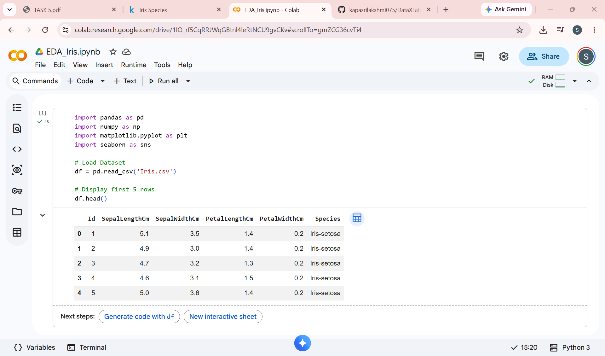
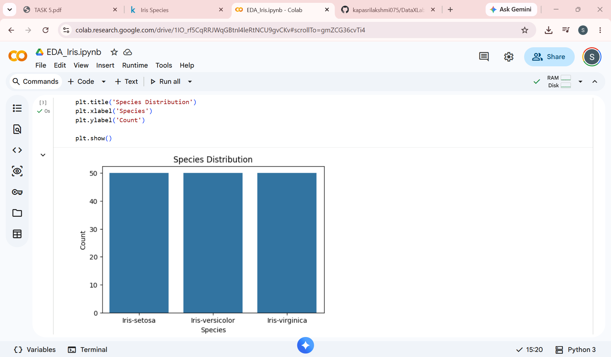
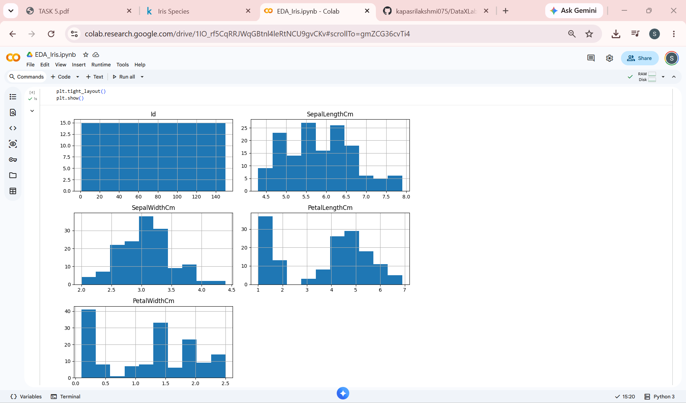
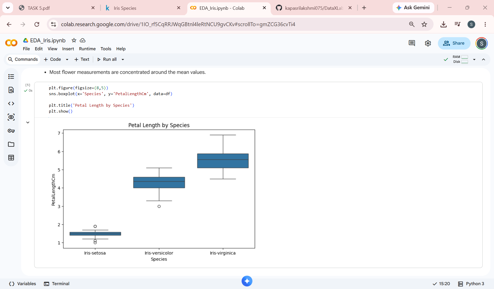
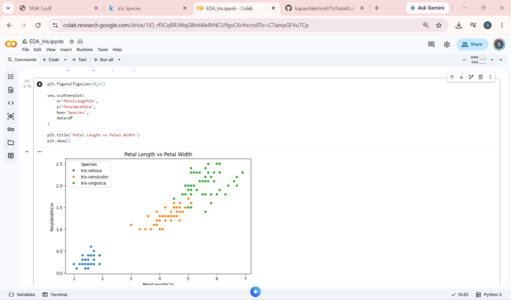
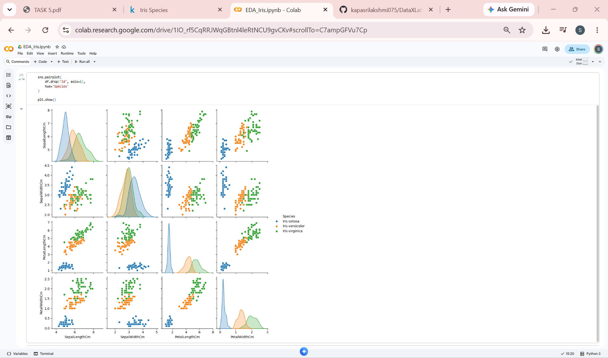
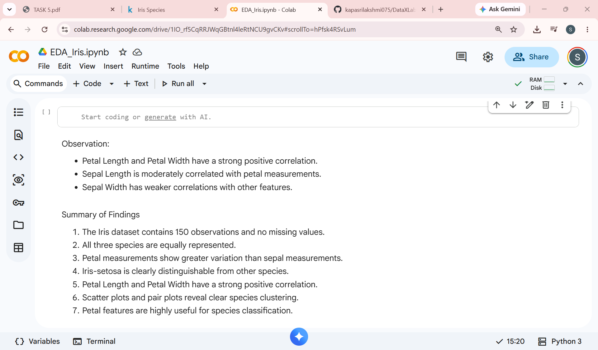

# 🌸 Exploratory Data Analysis (EDA) on Iris Dataset

## 📌 Project Overview

This project focuses on performing Exploratory Data Analysis (EDA) on the famous Iris Dataset using Python. The objective is to understand the dataset, identify patterns, visualize relationships between features, and extract meaningful insights through statistical and graphical analysis.

---

## 🎯 Objective

- Analyze the Iris Dataset using Python.
- Perform statistical exploration.
- Create meaningful visualizations.
- Identify relationships and trends among features.
- Summarize key findings.

---

## 🛠️ Tools & Libraries Used

- Python
- Pandas
- NumPy
- Matplotlib
- Seaborn
- Google Colab

---

## 📂 Dataset Information

The Iris Dataset contains 150 flower observations from three species:

- Iris-setosa
- Iris-versicolor
- Iris-virginica

### Features:

- Sepal Length
- Sepal Width
- Petal Length
- Petal Width
- Species

---

## 📊 Analysis Performed

### 1. Dataset Overview
- Data inspection using `head()`
- Dataset information using `info()`
- Statistical summary using `describe()`
- Missing value analysis

### 2. Data Visualization
- Species Distribution Plot
- Histograms
- Boxplot
- Scatter Plot
- Pair Plot
- Correlation Heatmap

---

## 📸 Project Screenshots

### Dataset Overview

### Species Distribution

### Histograms

### Boxplot

### Scatter Plot

### Pair Plot

### Correlation Heatmap

### Summary of Findings

---

## 🔍 Key Findings

- The dataset contains 150 observations and no missing values.
- All three species are equally represented.
- Petal measurements show greater variation than sepal measurements.
- Iris-setosa is clearly distinguishable from other species.
- Petal Length and Petal Width have a strong positive correlation.
- Scatter plots and pair plots reveal clear species clustering.
- Petal features are highly useful for species classification.

---

## ✅ Conclusion

The Exploratory Data Analysis revealed significant relationships between flower measurements and species classification. Petal features proved to be the most informative variables for distinguishing between Iris flower species. The visualizations provided clear insights into the structure and distribution of the dataset.

---

## 👩‍💻 Author

**Kapa Sri Lakshmi**

B.Tech CSE | Aspiring Data Analyst

GitHub: https://github.com/kapasrilakshmi075

---

### Internship Task

**DataX Labs – Data Analyst Internship**

**Task 5: Exploratory Data Analysis (EDA)**
